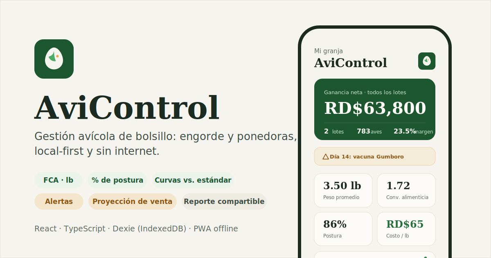

# AviControl

> **PWA de gestión avícola** para pollos de engorde y gallinas ponedoras: registro diario, métricas financieras y productivas, curvas contra el estándar de la raza, alertas y proyección de venta. **Local-first**: todos los datos viven en el teléfono y funciona sin internet.




**Demo en vivo:** https://avi-control.vercel.app — ábrela en el teléfono y usa *Añadir a pantalla de inicio* para instalarla como app.

---

## Qué es

App para productores avícolas que llevan el control de sus camadas en papel o en la cabeza. Cada lote (engorde o ponedoras) registra su día a día — mortalidad, alimento, peso, huevos — y la app calcula sola los números que deciden el negocio: conversión alimenticia, costo por libra, % de postura, costo por huevo, margen y ganancia. Pesos y alimento en **libras**, como se vende el pollo en República Dominicana.

Sin cuentas, sin servidor, sin internet: los datos se guardan en el dispositivo (IndexedDB) y se respaldan exportando un archivo `.json`.

## Funcionalidades

- **Lotes de engorde y ponedoras** con su ciclo completo: crear, registrar, vender, cerrar y comparar.
- **Registro diario en segundos**: mortalidad, descarte, alimento (lb), peso promedio o huevos recogidos.
- **Indicadores calculados solos**: FCA, costo/lb, costo/ave, % de postura, costo/huevo, margen y ganancia por lote.
- **Curvas contra el estándar de la raza**: peso vs. Ross 308 (engorde) y % de postura vs. ponedora comercial, alineada a la edad de entrada de las gallinas.
- **Alertas**: días sin registrar, mortalidad alta, FCA desviado, postura baja y días de vacuna del plan típico de engorde.
- **Proyección de venta**: fecha estimada para llegar al peso objetivo, alimento restante y libras totales en pie, escalando la curva estándar al rendimiento real del lote.
- **Comparación entre camadas**: tabla de lotes con el mejor valor de cada indicador resaltado — ¿cuál camada dejó mejor margen y por qué?
- **Reporte compartible**: genera una imagen del lote (finanzas + indicadores) lista para enviar por WhatsApp.
- **Ventas parciales y de descarte**, movimientos y registros editables, resumen semanal por lote.
- **Respaldo**: exportar/importar todos los datos en `.json`, con migración automática de respaldos antiguos.

## Arquitectura

SPA local-first sin backend. La capa de datos es reactiva: cualquier escritura en IndexedDB re-renderiza las vistas afectadas.

```
src/
  db/          Esquema Dexie (lotes, registros, gastos, ingresos)
  lib/         Lógica de dominio: métricas, curvas estándar, alertas,
               proyección de venta, reporte en canvas, formato es-DO
  components/  UI reutilizable (cards, sheets, gráficos, comparación)
  screens/     Inicio, Lotes, Detalle, Nuevo lote, Reportes, Ajustes
```

**Flujo de datos:** `IndexedDB (Dexie)` → `useLiveQuery` → `métricas puras` → `UI (React)`.

## Stack tecnológico

| Capa | Tecnologías |
|------|-------------|
| UI | React 19, Tailwind CSS, Motion (animaciones), Recharts (gráficos) |
| Datos | Dexie sobre IndexedDB, live queries reactivas |
| Offline / PWA | vite-plugin-pwa (Workbox), runtime caching de fuentes |
| Lenguaje / build | TypeScript, Vite |
| Reporte | Canvas 2D nativo + Web Share API |
| Despliegue | Vercel |

## Cómo ejecutar

```bash
# Requisitos: Node 20+
npm install
npm run dev       # desarrollo en http://localhost:5173
npm run build     # build de producción en dist/
```

## Instalar en el teléfono

1. Abre la URL en Safari (iPhone) o Chrome (Android).
2. **Compartir → Añadir a pantalla de inicio** (iOS) o **Instalar aplicación** (Android).
3. Se abre desde su ícono, a pantalla completa y sin conexión.
