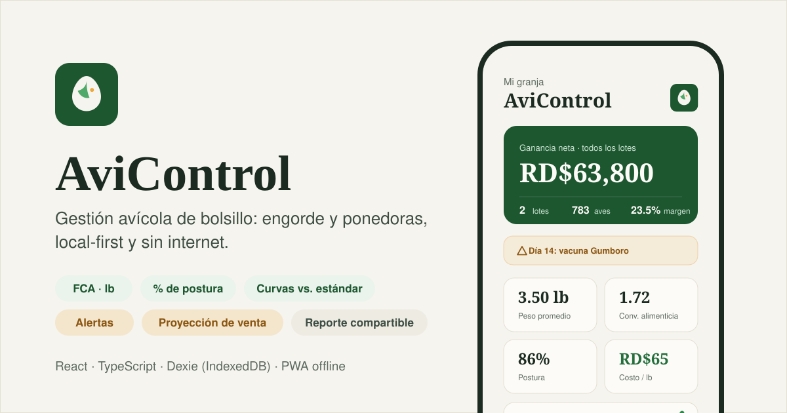

# AviControl

> **PWA de gestión de pollos de engorde Cobb 500**, organizada alrededor del ciclo: registro diario en segundos, guía del día contra el estándar de la línea, muestreo de peso, precio mínimo de venta y control de sociedad. **Local-first**: todos los datos viven en el teléfono y funciona sin internet.




**Demo en vivo:** https://avi-control.vercel.app — ábrela en el teléfono y usa *Añadir a pantalla de inicio* para instalarla como app.

---

## Qué es

App para engordadores que llevan el control de sus camadas en papel o en la cabeza. Toda la app gira alrededor del **ciclo de engorde** (~41 días) y de la única decisión que importa: **cuándo vender y a qué costo por libra**. Cada ciclo registra su día a día — mortalidad, alimento, peso — y la app calcula sola los números del negocio: conversión alimenticia, costo por libra, margen y ganancia. Pesos y alimento en **libras**, como se vende el pollo en República Dominicana.

Está especializada en **Cobb 500**: las curvas de peso, consumo y conversión son la tabla *as-hatched* del [Cobb500 Broiler Performance & Nutrition Supplement (2022)](https://www.cobbgenetics.com/assets/Cobb-Files/2022-Cobb500-Broiler-Performance-Nutrition-Supplement.pdf), día por día del 0 al 56.

Sin cuentas, sin servidor, sin internet: los datos se guardan en el dispositivo (IndexedDB) y se respaldan exportando un archivo `.json`.

## Funcionalidades

- **Ciclos de engorde** con barra de progreso e hitos (recibo, vacunas, cambios de alimento, retiro y venta), sobre la curva Cobb 500 escalada al rendimiento real del lote.
- **Registro diario en segundos**: mortalidad y descarte con *steppers*, alimento con chips sugeridos según tu consumo reciente, peso opcional.
- **Muestreo de peso**: dice cuántas aves pesar para que el promedio valga para todo el galpón, y al ir pesando calcula en vivo el promedio, el **margen de error** (IC 95 % con corrección por población finita), la **uniformidad** y el **CV**, el % del estándar Cobb y las libras vivas del galpón.
- **Guía del día**: peso ideal para la edad vs. el real, alimento del día y acumulado, FCA esperado, agua, temperatura de galpón, densidad y mortalidad esperada.
- **Plan de alimento en cuatro fases** (pre-inicio, iniciador, crecimiento, engorde) con proteína, energía y presentación de cada una: quintales y costo por fase, lo consumido vs. lo esperado y el día de cambio.
- **Existencia de alimento**: anotando los quintales de cada compra, la app lleva el saldo del galpón, calcula **hasta qué día alcanza** con el consumo real del lote, avisa cuando quedan tres días o menos, y usa el **precio real del quintal** — promedio ponderado de lo que pagaste — para costear el plan, la proyección y el precio de equilibrio.
- **Detalle en pestañas** (Hoy / Crecimiento / Dinero) con la curva de peso vs. estándar, índice de eficiencia (EPEF) y resumen semanal.
- **«¿A cómo vender?»**: precio mínimo por libra para no perder, cuánto de cada libra es alimento / pollito / lo demás, y la escalera de precios por margen (10 %, 15 %, 20 %, 25 %) con tu precio marcado en su lugar.
- **«¿Hasta qué día conviene?»**: el día en que la ganancia deja de subir, con la curva día por día y el **costo de la libra marginal** contra el precio de venta — porque cada día extra el pollo convierte peor y llega un punto en que engordarlo cuesta más de lo que se cobra por él.
- **Comederos y bebederos**: cuántos hacen falta para las aves que hay (tolvas, campanas, niples, bandejas y bebederos de crianza), en cuántas líneas se reparten, cada cuántos metros y pies va cada uno, y si el galpón aguanta esas aves al peso de venta. Cifras de la Guía de Manejo de Cobb.
- **«Si vendes…»**: compara la ganancia de vender hoy, al peso objetivo (recomendado) o más tarde, con la advertencia cuando las aves comen más de lo que crecen.
- **Proyección de venta financiera**: fecha estimada al peso objetivo, mortalidad que falta por ocurrir, alimento restante en quintales, costo e ingreso proyectados y **precio de equilibrio** por libra.
- **Sociedad**: reparte gastos y ganancias entre socios con % configurables, lleva cuánto aportó cada uno y calcula la **liquidación** (quién le debe a quién).
- **Alertas** con tope y prioridad por severidad: días sin registrar, días sin pesar, mortalidad alta, FCA desviado del estándar Cobb, cambios de fase de alimento, vacunas del plan típico y retiro del medicado antes de la venta.
- **Comparación entre camadas** y **reporte compartible** en imagen para WhatsApp.
- **Respaldo**: exportar/importar todos los datos en `.json`, con migración automática de respaldos antiguos.

## Arquitectura

SPA local-first sin backend. La capa de datos es reactiva: cualquier escritura en IndexedDB re-renderiza las vistas afectadas.

```
src/
  db/          Esquema Dexie (lotes, registros, pesajes, gastos, ingresos)
  lib/         Lógica de dominio: métricas, curva Cobb 500, plan de alimento,
               muestreo estadístico, equipo del galpón, alertas, proyección de
               venta, precios y punto óptimo, reporte en canvas, formato es-DO
  components/  UI reutilizable (cards, sheets, gráficos, comparación)
  screens/     Inicio, Lotes, Detalle, Nuevo lote, Reportes, Ajustes
```

**Flujo de datos:** `IndexedDB (Dexie)` → `useLiveQuery` → `métricas puras` → `UI (React)`.

## Stack tecnológico

| Capa | Tecnologías |
|------|-------------|
| UI | React 19, Tailwind CSS, Motion (animaciones), Recharts (gráficos) |
| Datos | Dexie sobre IndexedDB, live queries reactivas |
| Offline / PWA | vite-plugin-pwa (Workbox), runtime caching de fuentes |
| Lenguaje / build | TypeScript, Vite |
| Reporte | Canvas 2D nativo + Web Share API |
| Despliegue | Vercel |

## Cómo ejecutar

```bash
# Requisitos: Node 20+
npm install
npm run dev       # desarrollo en http://localhost:5173
npm run build     # build de producción en dist/
```

## Instalar en el teléfono

1. Abre la URL en Safari (iPhone) o Chrome (Android).
2. **Compartir → Añadir a pantalla de inicio** (iOS) o **Instalar aplicación** (Android).
3. Se abre desde su ícono, a pantalla completa y sin conexión.
